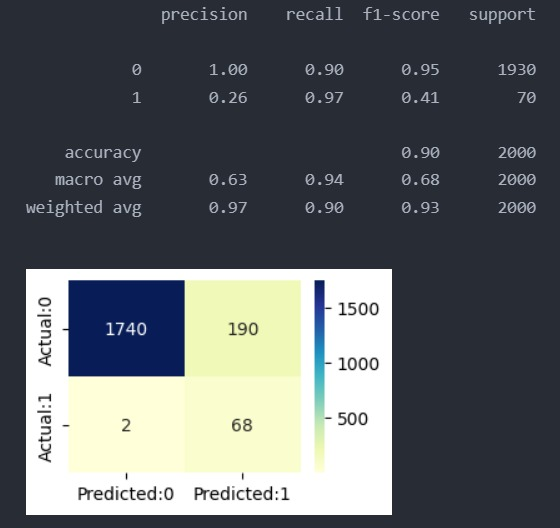
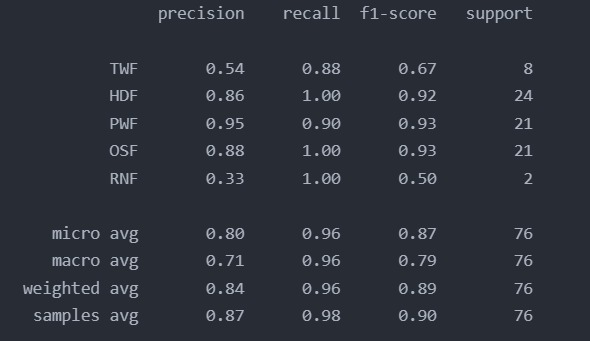

# Machine Failure Prediction Systems
Predict machine failure based on machine process parameters 

## Technology Used

## Features 
- Predict machine failure based on process parameter - Air temperature (K), Process temperature (K), Rotational speed (rpm), Torque (Nm) : Torsi mesin, Tool wear (min)
- Classify failure type into : TWF (Tool ware failure), HDF (Heat dissipation failure), PWF (Power failure), OSF (Overstrain failure), RNF(Random failure)
- Realtime dahsboard to analyze data & prediction history

## Dataset
Open Source Machine Predictive Maintenance Dataset (10k rows) : https://archive.ics.uci.edu/dataset/601/ai4i+2020+predictive+maintenance+dataset

## Model & Result
- Random Forest for Failure Prediction

  

- SVM for Failure Type Multiclass Clasification

  

